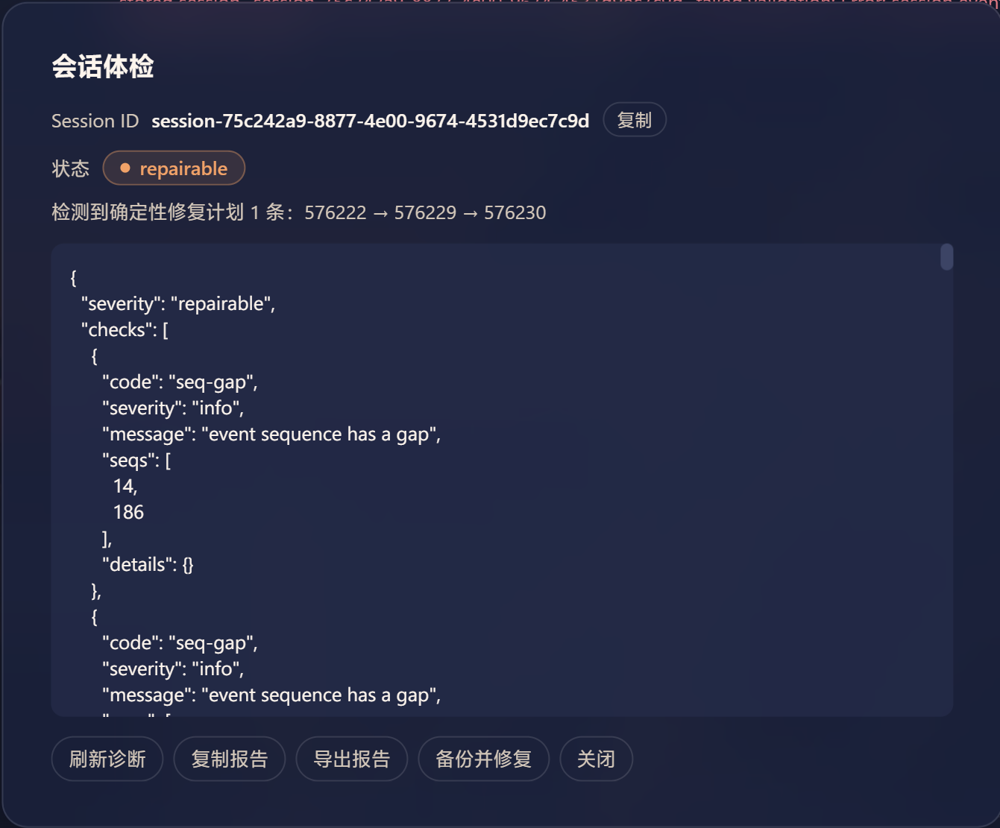
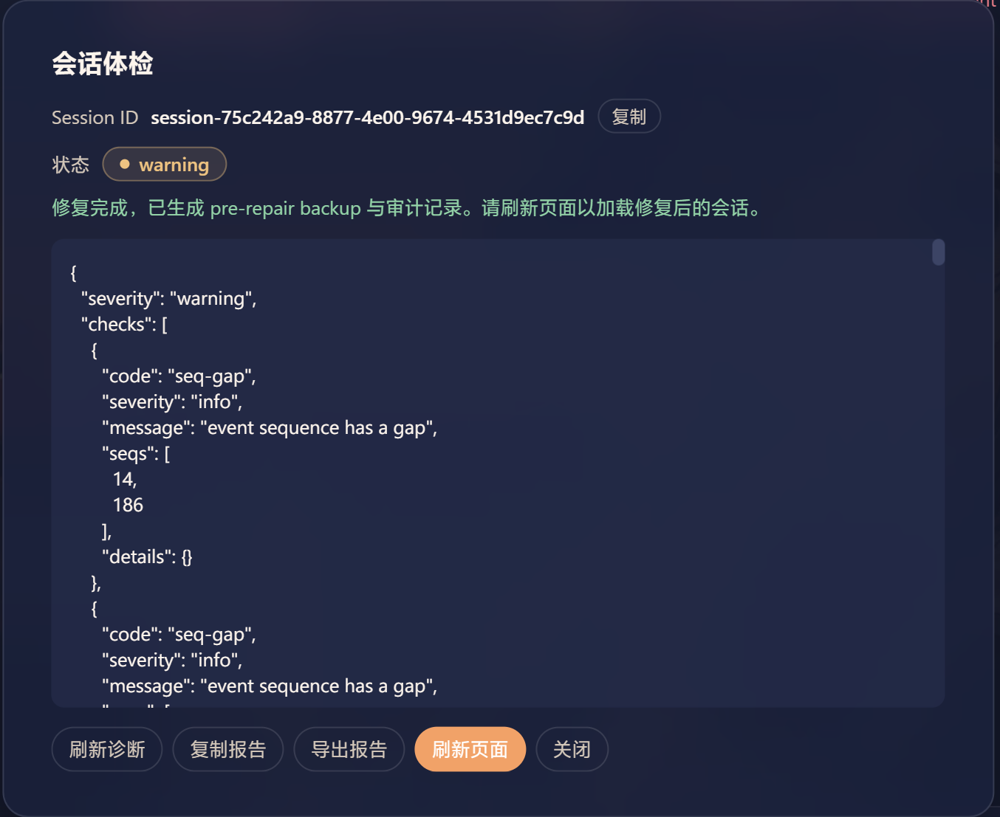

# dsh-session-repair

> [English](./README.md) | **中文**

DSH Web 会话诊断、可信 checkpoint、pre-repair backup 与安全修复插件。

  
  

## 安装

### 从 npm 安装（推荐）

    dsh plugin --profile web add dsh-session-repair

安装后重启 `dsh web`，再刷新 http://127.0.0.1:3080。

### 从 GitHub 安装

    dsh plugin --profile web add github:Zn-Dk/dsh-session-repair

### 开发阶段：link 本地源码

    cd /root/proj/dsh-proj/dsh-session-repair
    pnpm install
    pnpm build
    dsh plugin --profile web add link:/root/proj/dsh-proj/dsh-session-repair

修改源码后重启现有 dsh web；不要启动替代服务器。若同时运行 deepseek-harness 的 dev:web watcher，Client bundle 可通过现有 HMR 接收更新。

## 状态分级

诊断报告的 `severity` 由检查项汇总而来，用于决定是否显示可写修复入口：

| status | case-when |
| --- | --- |
| `healthy` | 无 blocked/repairable/warning 检查项。`seq-gap` 与 live 会话中未闭合的 turn/step 仅作 info 观察项，不抬高等级。 |
| `warning` | 已结束（非 live）的历史存在未闭合的 turn/step 结构，或有其他潜在问题。可读、不提供写入修复。 |
| `repairable` | 存在确定性可修复问题（如空 tool-call ID 链），可提交修复计划。 |
| `blocked` | 会话无法正常展示，且存在无法自动修复的硬冲突（如 ID 冲突、zstd 损坏、会话不匹配）。 |

## 为什么需要这个插件

当 DeepSeek 网关在 tool-call 增量帧里偶发把 `id`/`name` 发成空字符串（上游 [discussion #4365](https://github.com/deepseek-ai/deepseek-harness/discussions/4365) 跟踪的 identity-loss 家族），持久化历史会被「毒化」——之后每次加载都抛 `message must have tool source`，会话永久打不开。

dsh-session-repair 就在这个打不开的会话顶部**原位一键修复**——不用复制 sessionId、不用 agent 参与、不用手工切帧解压 zstd：

- 一键：在坏会话 header 点「会话体检」→「备份并修复」。
- 覆盖三种身份丢失形态：字段缺失、`null`、`""`。
- 一次性修复整条链（`assistant/message`、`tool/call`、`tool/result`）。
- 修复前强制 pre-repair backup，支持一键回滚，并保留审计记录。

上游已验证根因，并把我们的 closeBlock 兜底采纳为引擎侧修复蓝图的新增层（discussion #4365）。本插件是读取路径的恢复侧补全：它修复已经毒化的历史，引擎 patch 则阻止新的毒化写入。

## 使用

打开任意会话，在 Chat header 点击「会话体检」。当报告为 repairable 且至少有一条确定性修复计划时，面板会显示「备份并修复」按钮，并列出全部待修 seq 链。点击后先确认目标 seq 和 pre-repair backup，再一次性执行修复并重新校验；歧义、live、文件变化或其他 blocked 状态不会显示可写修复按钮。

面板按钮说明：

- 「刷新诊断」：重新读取当前会话工件并更新报告。
- 「复制报告」：把诊断 JSON 复制到剪贴板。
- 「导出报告」：下载诊断报告 JSON 文件。
- 「恢复上次修复前」：仅当会话为 repairable/blocked 且存在 pre-repair 备份时显示，一键回滚到最近一次修复前的状态。
- 「清空备份」：手动清空 safety 备份。
- 「备份并修复」：仅当报告为 `repairable` 且存在确定性修复计划时显示。

### Agent 工具（模型调用）

插件注册了一个**模型可调用工具** `dsh_session_repair`，它不是用户手动触发，而是由 agent 判断并调用：

- 参数：`sessionId`（可选；缺省时诊断当前会话）
- 返回：结构化诊断报告（severity / checks / repairPlans / maxSeq / eventCount 等）

典型用法：

1. 在**健康会话**里对 agent 说：「诊断 session-xxxx 这个 history unavailable 会话」，agent 会调用 `dsh_session_repair` 并传入旧 sessionId。
2. 在当前会话里对 agent 说：「帮我体检一下当前会话」，agent 调用时不传 sessionId，诊断当前会话。

注意：该工具只做**只读诊断**，不会执行修复。修复仍需在 header 的「会话体检」面板里点按钮完成。

## 安全边界

Host 先读取 raw storage，再决定是否调用引擎展示接口。Client 不直接触碰 ~/.dsh，也不能提交任意 JSON patch。修复使用 batchId 与 artifact fingerprint，修复前必生成 pre-repair backup，复验成功后才原子替换。多条独立空 ID 链在一次性批次中修复；歧义、zstd 损坏、文件变化、live/追加中的会话一律不写入。live 会话通过 `ctx.get('sessions')` / `ctx.get('agents')` 判定，其未闭合的 turn/step 属正常追加状态，仅记为 info。

插件自有数据位于 ~/.dsh/session-repair/，包括 backups 和 audit。外部 ~/.dsh/backup-sessions-* 目录只作为 legacy 取证与比较来源，默认不自动恢复。

## 当前实现状态

当前仓库已包含 raw zstd/JSONL 诊断、tool-call ID 检查、确定性 repair plan、checkpoint/pre-repair backup 写入、backup 列表/对比、报告导出、RPC、Agent tool、header 报告面板和随包 Skill。全部端点为已实现或明确返回 not-implemented，不会伪装成功。

## 发布与收录

- npm：[dsh-session-repair](https://www.npmjs.com/package/dsh-session-repair)
- GitHub：https://github.com/Zn-Dk/dsh-session-repair
- Releases：https://github.com/Zn-Dk/dsh-session-repair/releases
- 收录：**已被 [awesome-dsh-plugin](https://github.com/awesome-dsh-plugin/awesome-dsh-plugin) 与 [awesome-deepseek-harness](https://github.com/0xsline/awesome-deepseek-harness) 收录**（awesome 侧 category: `session`；见 `data/plugins/Zn-Dk__dsh-session-repair.yml`）

## Skill

随包 Skill 发布在 `skills/dsh-session-repair/SKILL.md`，由 Host runtime 注册；与插件同名但属于不同注册表，不单独发布、不使用 submodule、不默认软链接。
